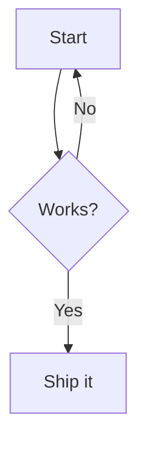

## Mermaid diagrams

Set `mermaid = true` under `[build]` and fenced ` ```mermaid ` code blocks render as [Mermaid](https://mermaid.js.org/) diagrams — the same syntax Hugo, Zola, and GitHub accept, no shortcode required:

````markdown

````

Each block is emitted as `<div class="mermaid">…</div>`, and a small client-side Mermaid loader is injected **only on pages that actually contain a diagram** — diagram-free pages have zero overhead. Diagrams render in the browser, so they work with every bundled and custom theme.

With `mermaid = false` (the default), a ` ```mermaid ` block is treated like any other unrecognized language and rendered as a plain code block, so existing sites are unaffected.

Requested in [#87](https://github.com/seite-sh/seite/issues/87).
